# MediMantra

**A voice-first medicine companion for elderly people in India.** It reads the
prescription, reminds them in their own language, and quietly tells the family
when a dose is missed.

*Medi* + *mantra* (a formula you repeat until it becomes habit). The built-in
voice assistant is **MediMitra**, *mitra* meaning "friend".

<p>
  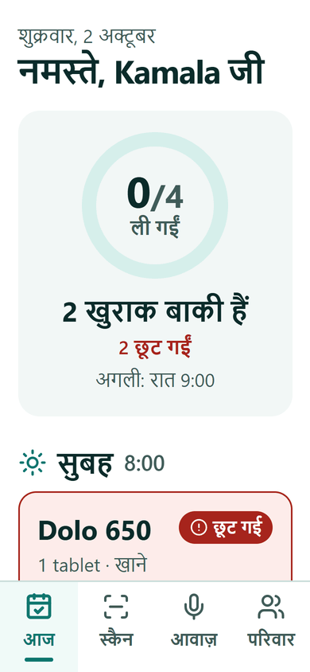
  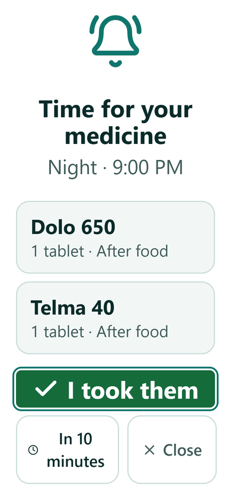
  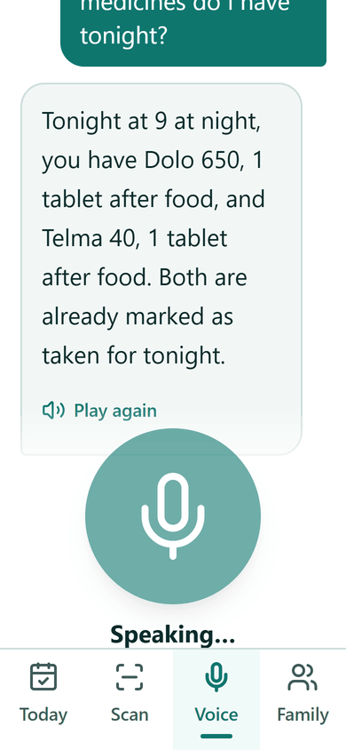
  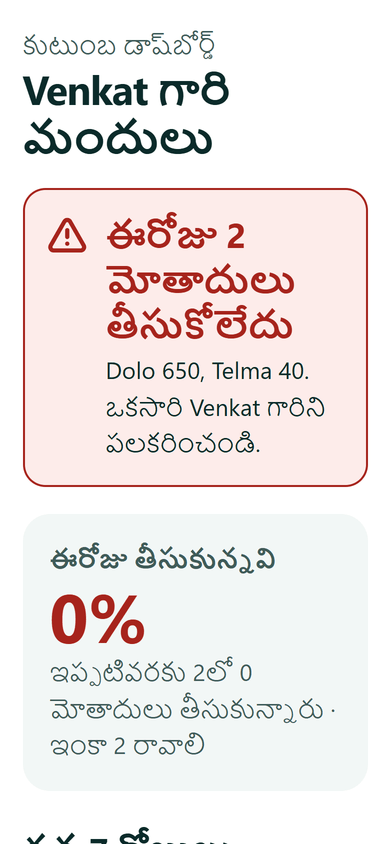
</p>

---

## Contents

- [The problem](#the-problem)
- [What MediMantra does](#what-medimantra-does)
- [Impact](#impact)
- [A tour of the app](#a-tour-of-the-app)
- [Tech stack](#tech-stack)
- [System architecture: high level](#system-architecture-high-level)
- [System architecture: low level](#system-architecture-low-level)
- [Database schema](#database-schema)
- [Run it locally](#run-it-locally)
- [Testing](#testing)
- [MediMantra and Wispr Flow](#medimantra-and-wispr-flow)
- [Limitations and roadmap](#limitations-and-roadmap)
- [Project layout](#project-layout)

---

## The problem

India had **149 million people aged 60 and over in 2022, and is projected to
have 347 million by 2050**, about one person in five
([UNFPA India Ageing Report 2023](https://www.thenationalnews.com/world/asia/2023/09/28/india-un-elderly-population/)).
Most of them manage several long-term medicines. Getting them right is hard:

- **Taking medicines as prescribed is the exception, not the rule.** The WHO
  found that adherence to long-term therapy averages only about 50% even in
  developed countries, and is lower in developing ones
  ([WHO, *Adherence to long-term therapies*, 2003](https://www.who.int/news/item/01-07-2003-failure-to-take-prescribed-medicine-for-chronic-diseases-is-a-massive-world-wide-problem)).
- **Prescriptions are written in code.** `1-0-1`, `BD`, `TDS`, `HS`, `AC`,
  `PC`: shorthand that is obvious to a doctor and opaque to a patient,
  often handwritten.
- **Duplicates and interactions slip through.** Two brands of the same drug
  (Dolo and Crocin are both paracetamol), or a painkiller that clashes with a
  heart tablet, arrive from different doctors on different days.
- **Health apps assume young, English-reading, typing users.** Small text,
  dense screens and English-only labels shut out the people who need help most.
- **Families worry from a distance.** Children living in another city have no
  way of knowing whether a parent took their blood-pressure tablet.

## What MediMantra does

| Problem | What MediMantra does |
| --- | --- |
| Prescriptions in shorthand | **Scan** a photo. A vision model extracts each medicine, its dose, morning/afternoon/night, food instruction and duration, and understands Indian shorthand (`OD`, `BD`, `TDS`, `QID`, `HS`, `SOS`, `AC`/`PC`, `1-0-1`, `101`). The patient checks and edits big, simple cards before anything is saved. |
| Duplicates and interactions | The same scan flags **duplicate ingredients and drug interactions**, with severity and one plain sentence, in the patient's language. They're shown as red or orange banners with a clear "not medical advice, ask your doctor" note. |
| Forgetting doses | **Reminders** at 8 AM, 1 PM and 9 PM: a soft chime, a browser notification, and a full-screen card with one huge **Taken** button. Doses more than 2 hours late are marked missed automatically. |
| Typing and reading are hard | **MediMitra**, a voice assistant. Ask "what do I take now?" or say "I took my Dolo" and it answers out loud, warmly, in Hindi, Telugu or English. It marks doses as taken, and never gives medical advice. |
| English-only apps | **Every label in English, हिन्दी and తెలుగు**, chosen once at onboarding and changeable any time. 18px base text, high-contrast teal on white, 56px+ touch targets, dark mode, and pinch-zoom left on. |
| Families can't see | A **family link** (6-character code) opens a read-only dashboard with no sign-up: today's adherence, a 7-day chart, and a **red alert when 2 or more doses are missed**. Share it on WhatsApp in one tap. |

## Impact

MediMantra is a working prototype, not a clinically validated product. The
impact below is what it is designed for, not something measured in a trial.

- **For patients:** fewer missed and doubled doses. Independence without
  needing to read English or type. Answers in their own language, by voice.
- **For families:** peace of mind from a single shared link, and an early
  warning when something has gone wrong that day rather than at the next
  doctor's visit.
- **For doctors and pharmacists:** a seven-day adherence picture the family
  can show them, and patients who arrive already aware of a flagged
  duplicate or interaction.
- **Inclusion by default:** the app is built around the people usually left
  out: elderly users, non-English readers, and those with tremor, arthritis
  or low vision.

## A tour of the app

| | | |
| :---: | :---: | :---: |
| 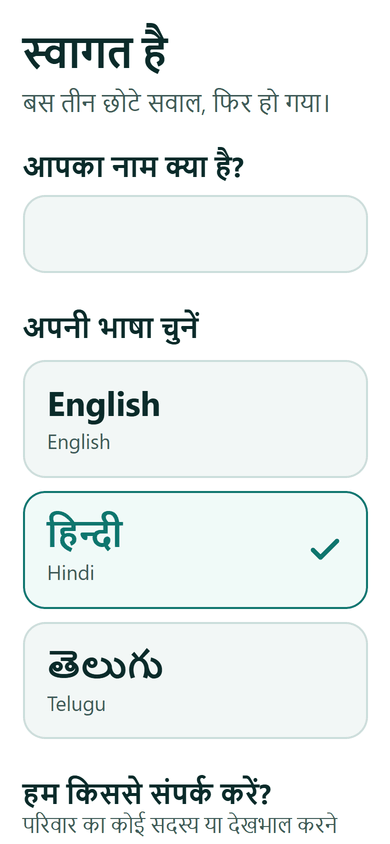 | 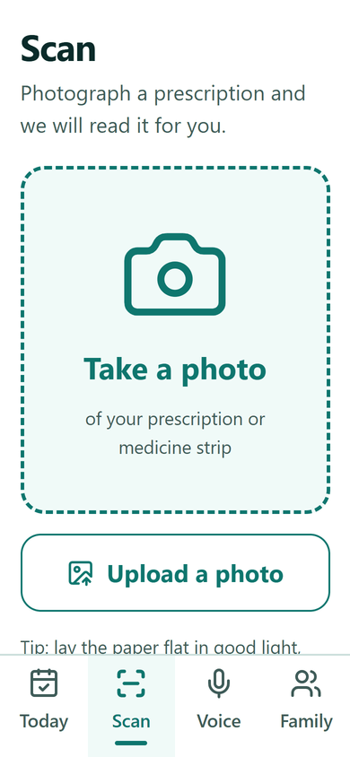 |  |
| **Onboarding.** Three questions. The whole screen switches language the moment a language is tapped. | **Scan.** A big camera button, an upload button, and a "Reading your prescription…" scanner animation. | **Today.** Greeting, progress ring, doses grouped by time. The next dose glows. |
|  |  | 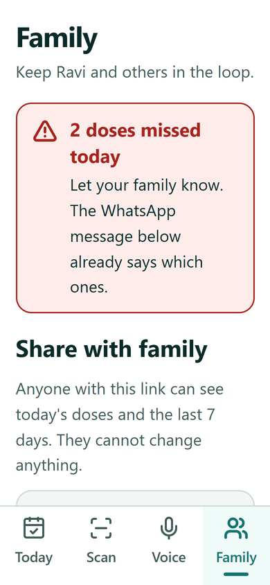 |
| **Reminder.** Chime, notification and a full-screen card with one big button. | **MediMitra.** Tap, speak, and hear the answer. Large chat bubbles. | **Family tab.** Share code, Copy link, Share on WhatsApp, language and sign-out settings. |
|  | 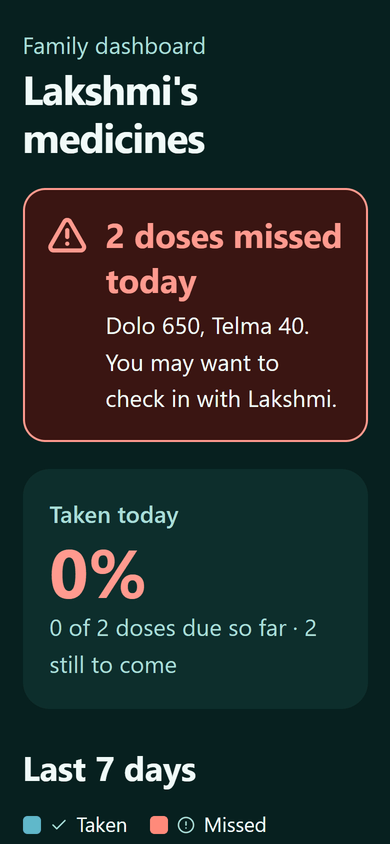 | |
| **Family dashboard** (public link), in the patient's language. | **Dark mode** with its own validated colours. | |

On a laptop the bottom tab bar becomes a sidebar and the screens spread into
two columns:

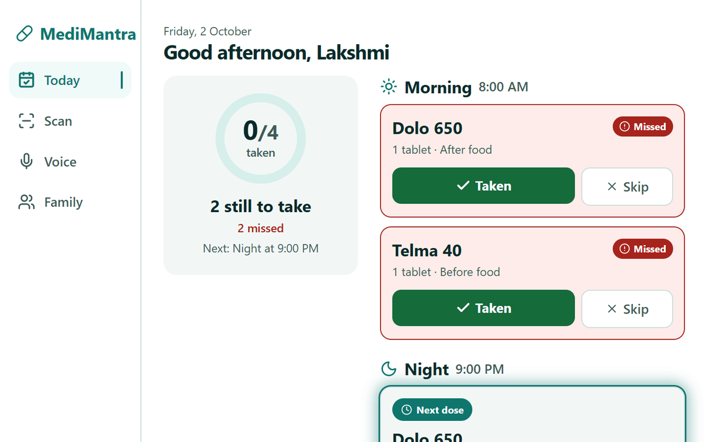

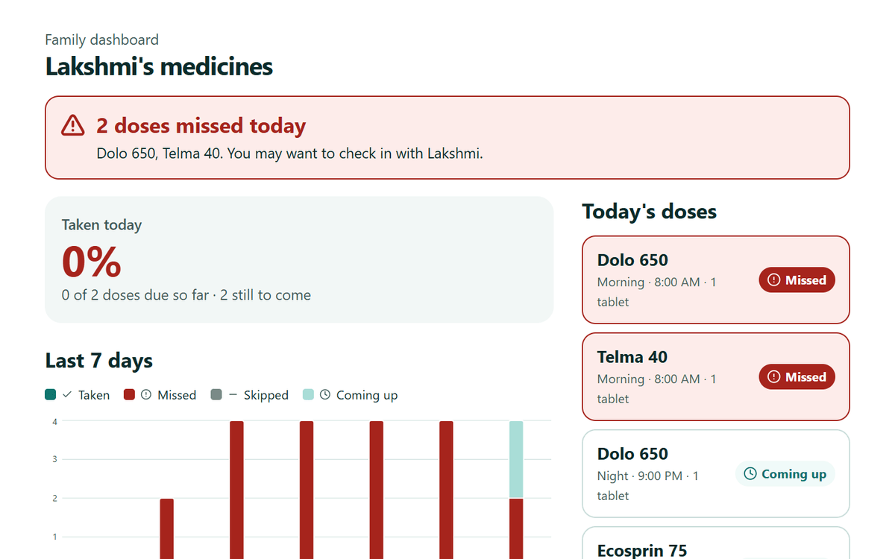

> Screenshots come from the production build, driven by a headless browser
> against demo patients (no real data).

## Tech stack

| Layer | Choice | Why |
| --- | --- | --- |
| Framework | **Next.js 16** (App Router, React 19, TypeScript) | Server components keep data and secrets on the server; server actions give buttons that work even before JavaScript loads. |
| Styling | **Tailwind CSS v4** with design tokens | One file of tokens (colour, 18px type scale, touch sizes) drives light and dark themes. |
| Icons | **lucide-react** | Clear, consistent line icons; always paired with a text label. |
| Charts | **Recharts** | 7-day stacked adherence chart, with a table view for screen readers. |
| Database | **Supabase Postgres**, reached over a **connection string** with [postgres.js](https://github.com/porsager/postgres) | A plain SQL schema with row-level security enforced by a dedicated non-superuser role. |
| AI: vision | **OpenAI `gpt-5.5`**, Responses API with structured outputs | Reads prescriptions and returns JSON constrained by a Zod schema. |
| AI: voice | **`gpt-4o-transcribe`**, **`gpt-5.5`**, **`gpt-4o-mini-tts`** | Speech to text, the MediMitra conversation, and a warm, slow voice reply. |
| Validation | **Zod 4** | One schema validates forms, server actions and the model's output. |
| Auth | Hand-rolled: **scrypt** passwords and an **HMAC-signed cookie** | No Supabase Auth, since the app talks to Postgres directly. The cookie's patient id is what row-level security keys on. |
| i18n | A **plain dictionary file** ([`lib/i18n.ts`](lib/i18n.ts)) | English, Hindi and Telugu. TypeScript fails the build if any translation is missing. |
| Testing | Node test scripts and **Playwright** | End-to-end against the real database and models. |

## System architecture: high level

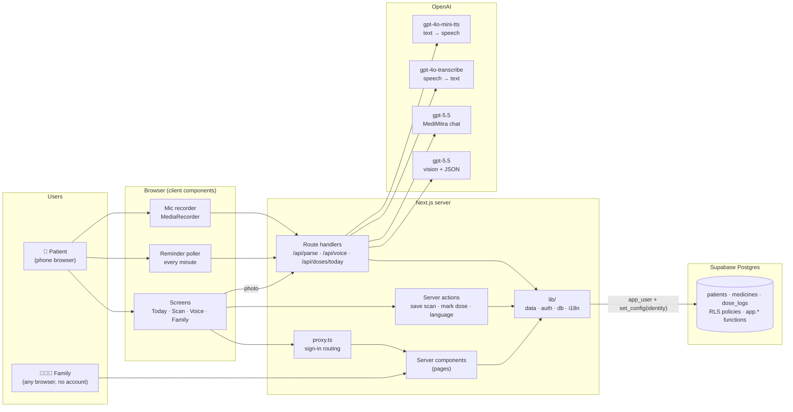

**In short:** the browser renders server-made pages and posts small forms.
Three API routes handle the heavy or binary work (photos, audio, the reminder
feed). Every database call runs as a restricted role with the patient's
identity attached, so Postgres itself refuses to show one patient's data to
another. OpenAI is only ever called from the server, so keys never reach the
browser.

## System architecture: low level

### Modules

| Module | Responsibility |
| --- | --- |
| [`proxy.ts`](proxy.ts) | Runs before every page: sends signed-out visitors to onboarding and signed-in users away from onboarding and sign-in, with real 307s. |
| [`lib/session-token.ts`](lib/session-token.ts) | Signs and verifies the session cookie (`patientId.role.HMAC`). Shared by the proxy and `auth.ts`. |
| [`lib/auth.ts`](lib/auth.ts) | scrypt password hashing, sessions, register / sign-in / share-code sign-in, and the language cookie. Returns error *codes* for the UI to translate. |
| [`lib/db.ts`](lib/db.ts) | Lazy postgres.js pool, plus `withPatient(id, role, fn)`, which runs `fn` in a transaction with `app.current_patient` and `app.current_role` set. |
| [`lib/data.ts`](lib/data.ts) | Every query: patients, medicines, saving a scan, generating dose rows, marking overdue doses missed, adherence, marking doses taken by voice. |
| [`lib/schema.ts`](lib/schema.ts) | Client-safe types, constants and Zod schemas, including the strict JSON schema the vision model must fill. |
| [`lib/prescription.ts`](lib/prescription.ts) | The vision call and its prompt, including the Indian shorthand rules. |
| [`lib/assistant.ts`](lib/assistant.ts) | MediMitra: transcribe → converse (grounded in today's schedule) → speak. |
| [`lib/i18n.ts`](lib/i18n.ts) | English / Hindi / Telugu dictionary, locales and the greeting by time of day. |
| [`lib/current.ts`](lib/current.ts) | Per-request cached session, patient and language, so the layout and page share one lookup. |

### Security: three layers, each enough on its own to stop the obvious attack

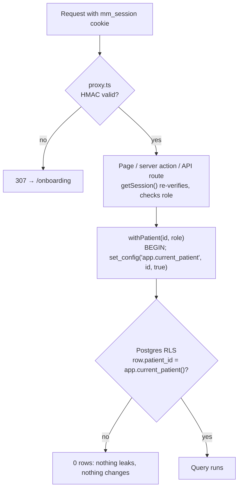

- The app connects as **`app_user`**, which has no `BYPASSRLS`. Connecting as
  Supabase's default `postgres` role would silently switch every policy off.
- Identity is set with `set_config(…, true)`, which is **transaction-local**,
  so it can't leak to the next request that reuses a pooled connection.
- With no identity set, every policy fails closed: zero rows.
- Sign-up, sign-in and share-code look-ups have to read a row before any
  identity exists. They go through narrow `security definer` functions
  (`app.create_patient`, `app.auth_lookup`, `app.auth_language`,
  `app.set_password`, `app.resolve_share_code`) instead of loosening a policy.
- **The voice and scan routes never take a patient id from the request.** It
  always comes from the signed cookie.

### Flow: scanning a prescription

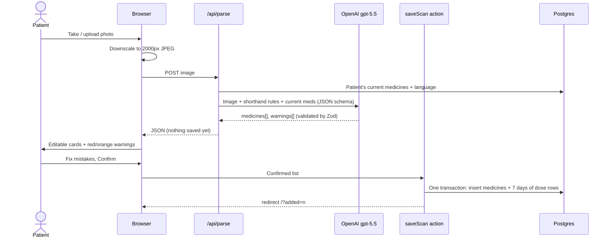

### Flow: MediMitra voice turn

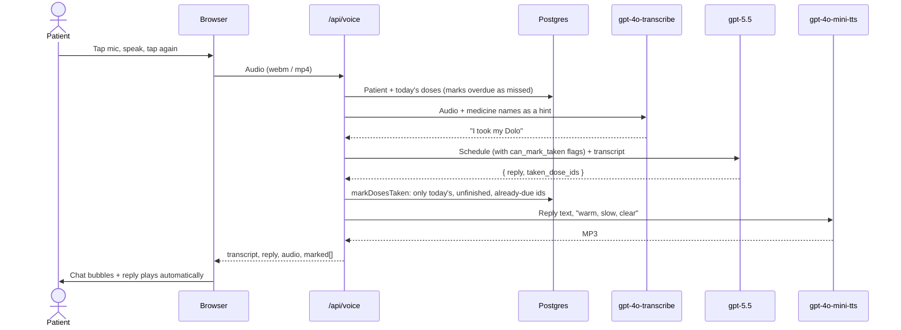

The model only **proposes** which doses to mark. `markDosesTaken` is the
gate: it re-checks each id against the database. That is why "I took my night
tablet" said at 2 PM is politely refused.

### Flow: reminders and the dose lifecycle

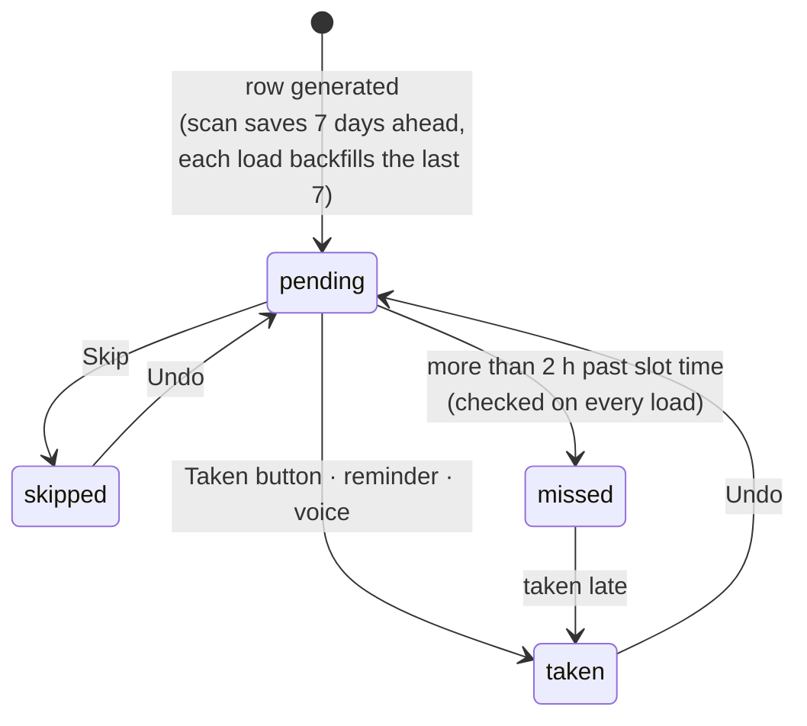

- **Slot times** are 8 AM, 1 PM and 9 PM, Indian time. "Today" and "is it
  overdue" are computed **in Postgres** (`app.today()`,
  `app.dose_due_at()`), because the server runs on UTC and would otherwise be
  a day off for 5½ hours every day.
- **Rows are generated lazily**, with no cron job. Saving a scan creates 7
  days ahead. Each dashboard load backfills the past week, so days nobody
  opened the app still show as *missed* rather than vanishing from the
  history. The unique constraint makes this idempotent.
- A medicine added mid-day gets **no doses for slots that were already
  overdue**, so a prescription scanned at 3 PM doesn't show that morning as
  missed.
- **The reminder poller** (client) fetches `/api/doses/today` every minute
  and whenever the tab becomes visible again. When a slot comes due it plays
  a Web Audio chime, shows a notification and opens the full-screen card.
  Each dose rings once; "In 10 minutes" re-arms it.

### Internationalisation

- [`lib/i18n.ts`](lib/i18n.ts) defines `en`; `hi` and `te` must match its
  shape exactly, checked by TypeScript. Strings that contain numbers or names
  are small functions, so word order can differ by language.
- The language comes from the signed-in patient. Signed-out screens use an
  `mm_lang` cookie set at onboarding or sign-in, which also lets loading
  screens render in the right language without a database lookup.
- Server and model messages are **codes**, translated on the client.
  Interaction warnings and MediMitra's replies are generated directly in the
  patient's language.
- Medicine names are never translated: they must match the strip.

## Database schema

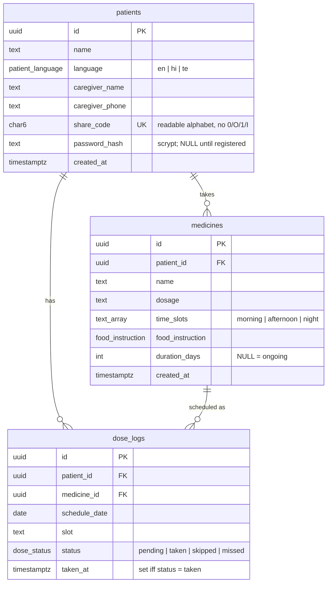

**Constraints worth knowing**

| Table | Constraint | Why |
| --- | --- | --- |
| `dose_logs` | `unique (medicine_id, schedule_date, slot)` | One row per dose; makes generation idempotent. |
| `dose_logs` | `check ((status = 'taken') = (taken_at is not null))` | A taken dose always has a time; nothing else does. |
| `medicines` | `check (cardinality(time_slots) > 0)` | Every medicine has at least one time. |
| `patients` | `share_code` matches `^[2-9A-HJ-NP-Z]{6}$` | Easy to read aloud over the phone. |

**Row-level security** (`enable` and `force` on all three tables)

| Policy | Rule |
| --- | --- |
| Read anything | `patient_id = app.current_patient()` |
| Edit profile, add or change medicines | the above **and** `app.current_role() = 'patient'` |
| Mark doses | the above, either role (family can tick a dose off) |

**Functions**

| Function | Purpose |
| --- | --- |
| `app.current_patient()`, `app.current_role()` | Read the transaction's identity. |
| `app.today()`, `app.slot_time(slot)`, `app.dose_due_at(date, slot)` | The Indian-time schedule clock. |
| `app.create_patient`, `app.auth_lookup`, `app.auth_language`, `app.set_password`, `app.resolve_share_code` | Narrow `security definer` paths for flows that run before an identity exists. |

The full DDL is in [`schema.sql`](schema.sql).

## Run it locally

You'll need Node.js 20 or newer, a free [Supabase](https://supabase.com)
project, and an [OpenAI API key](https://platform.openai.com/api-keys).

**1. Clone and install**

```bash
git clone https://github.com/r-rishit27/whisperflow.git medimantra
cd medimantra
npm install
```

**2. Configure**

```bash
cp .env.example .env
```

Fill in:

| Variable | Where to get it |
| --- | --- |
| `ADMIN_DATABASE_URL` | Supabase → **Project Settings → Database → Connection string**. The `postgres` user, with your database password. Use the **Session pooler** string if your network has no IPv6. |
| `OPENAI_API_KEY` | OpenAI dashboard. |
| `SESSION_SECRET` | Run `node -e "console.log(require('crypto').randomBytes(32).toString('hex'))"` |

**3. Create the database and the app role**

```bash
npm run db:migrate     # applies schema.sql (idempotent)
npm run db:provision   # creates app_user and prints its DATABASE_URL
```

Paste the printed `DATABASE_URL=…` line into `.env`. That is the restricted
role the app runs as; `ADMIN_DATABASE_URL` is only for migrations.

**4. Run**

```bash
npm run dev
```

Open <http://localhost:3000>. You'll land on onboarding. Pick a language,
add a caregiver, then **Scan** any prescription photo. For the full
experience, allow notifications and the microphone when asked.

**5. (Optional) Production build**

```bash
npm run build && npm start
```

Set `APP_URL` to your public address in production, so family share links
point at the right host.

### Environment reference

| Variable | Required | Purpose |
| --- | --- | --- |
| `DATABASE_URL` | yes | App connection as `app_user` (subject to RLS). |
| `ADMIN_DATABASE_URL` | for setup | Owner connection for `db:migrate`, `db:provision` and test clean-up. |
| `OPENAI_API_KEY` | yes | Scanning and MediMitra. |
| `SESSION_SECRET` | yes | Signs the session cookie, 32+ characters. Rotating it signs everyone out. |
| `APP_URL` | production | Public origin for share links. |
| `OPENAI_VISION_MODEL`, `OPENAI_CHAT_MODEL` | no | Default `gpt-5.5`. |
| `OPENAI_STT_MODEL`, `OPENAI_TTS_MODEL`, `OPENAI_TTS_VOICE` | no | Defaults `gpt-4o-transcribe`, `gpt-4o-mini-tts`, `coral`. |

## Testing

Every suite runs **end to end** against the real database (and, where noted,
the live OpenAI models), creates its own demo patients, and deletes them
afterwards.

| Command | Checks | What it proves |
| --- | ---: | --- |
| `npm run db:verify` | 37 | Schema, constraints, dose generation, and that **RLS really blocks** cross-patient reads and writes. |
| `npm run app:verify` | 45 | Onboarding, welcome, sign-in, registration, family sign-in and forged cookies, all driven without JavaScript. |
| `npm run scan:verify` | 39 | A seeded prescription is read correctly (every shorthand, a duplicate, an interaction), edited, saved, and appears on the dashboard. *Uses OpenAI.* |
| `npm run voice:verify` | 23 | Synthesised speech in English, Hindi and Telugu. Marks the right doses, refuses not-yet-due ones, declines medical advice. *Uses OpenAI.* |
| `npm run family:verify` | 34 | The public dashboard's numbers match the database, the alert threshold works, and the WhatsApp message and reminder feed are correct. |
| `npm run i18n:verify` | 26 | Hindi and Telugu patients see their own script on every screen, with no English UI words, and switching language takes effect everywhere. |

The `*:verify` suites other than `db:verify` need `npm run dev` running in
another terminal (pass `-- --base http://localhost:3000` if needed). On top of
these, a Playwright pass checked what only a real browser can: the reminder
firing at a faked 9:01 PM, the chime and notification, the Recharts chart in
light and dark, speaking into a fake microphone, and layout at phone and
desktop widths. That's 227 checks in total.

CI ([`.github/workflows/ci.yml`](.github/workflows/ci.yml)) runs typecheck,
lint and a production build on every push, plus a check that `.env` is never
committed.

## MediMantra and Wispr Flow

This repository began life as **Whisperflow**: voice-to-text tooling on
OpenAI speech models and Supabase. MediMantra grew out of that foundation,
and shares its core belief with [Wispr Flow](https://wisprflow.ai), the
voice-dictation product: **for many people, speaking is a better interface
than typing.**

**How Wispr Flow has proven that belief.** Wispr Flow turns natural speech
into clean, polished text in any app. Its growth shows that voice-first
computing has gone mainstream:

- **Adoption.** By January 2026 it was used inside **270 Fortune 500
  companies**, with users and annual recurring revenue growing **40% month
  over month**. Its Android waitlist drew **375,000 verified sign-ups in under
  a week** (February 2026)
  ([Reworked](https://www.reworked.co/ai-platforms/wispr-hits-2b-valuation-launches-canto-voice-model/)).
- **Investment.** $81 million raised by November 2025
  ([Pulse 2.0](https://pulse2.com/wispr-25-million-series-a-extension/)),
  then a **$280 million Series B at a $2 billion valuation**, led by Menlo
  Ventures (August 2026), for $361 million in total
  ([Reworked](https://www.reworked.co/ai-platforms/wispr-hits-2b-valuation-launches-canto-voice-model/)).
- **Reach.** It supports **100+ languages, including Hinglish**, and positions
  itself as an accessibility tool for people with motor impairments,
  Parkinson's, arthritis, RSI, dyslexia, ADHD and visual challenges
  ([Wispr Flow](https://wisprflow.ai/post/revolutionizing-accessibility-tools),
  [VoiceAI Space](https://www.voiceaispace.com/tool/wispr-flow)). Its *Canto*
  speech model is trained for noisy rooms and mixed-language speech.

**Why that matters here.** An elderly patient in India is the extreme case of
the user Wispr Flow serves. Their hands may shake, a phone keyboard may be in
an unfamiliar script, and they may speak Hindi and English in the same
sentence. MediMantra applies the same "speak, don't type" principle to one of
the highest-stakes daily tasks there is:

| Wispr Flow principle | In MediMantra |
| --- | --- |
| Voice as the primary input | MediMitra: ask about your medicines, or say you took one, out loud. |
| Works in the user's own language, including mixed language | Replies always in the patient's language. The speech-to-text language is a hint, not a constraint, so code-mixed Hindi-English still works. |
| Accessibility first | 18px base text, 56px touch targets, high contrast, full-screen reminders, no typing needed for daily use. |
| Speech cleaned into intent | The transcript becomes an *action*: the right doses marked taken, checked against the schedule. |

**To be clear:** MediMantra does not use Wispr Flow's software or API. Its
speech runs on OpenAI's `gpt-4o-transcribe` and `gpt-4o-mini-tts`. Wispr has
said it plans to open API access to third-party developers
([Pulse 2.0](https://pulse2.com/wispr-25-million-series-a-extension/)). A
noise-robust, mixed-language model like Canto would suit elderly homes, where
the TV is often on in the background, and is a natural future integration.

**The impact this approach creates.** Voice-first design moves health tech
from "for people who can use apps" to "for people who can talk". In a country
heading for 347 million older adults, that is the difference between an app
that helps the people who need it and one they can't use.

## Limitations and roadmap

**Known limits, stated plainly:**

- **Not a medical device.** Prescription reading and interaction warnings
  come from a language model. They can be wrong, and are always shown with a
  "confirm with your doctor" note. Patients review every medicine before it
  is saved.
- **Reminders need the app open** (in a tab or installed). Reaching a closed
  browser needs Web Push and a service worker.
- **Share codes** are about a billion combinations but are not
  rate-limited. Add rate limiting on `/family/[code]` before a public
  launch.
- **An unknown share code returns HTTP 200** (with a friendly translated
  "not found" page and `noindex`), because the page streams behind a loading
  screen before the look-up finishes.
- **A voice turn takes about 7–8 seconds**: three model calls in sequence.
- **One time zone** (India) and three fixed slots (8 AM, 1 PM, 9 PM).

**Next:**

- [ ] Web Push reminders that work with the app closed, plus SMS or WhatsApp
      escalation to family.
- [ ] Streaming voice (realtime speech) to bring replies under 2 seconds.
- [ ] Custom dose times per medicine; refill reminders from pill counts.
- [ ] More Indian languages (Tamil, Kannada, Marathi, Bengali).
- [ ] A doctor-facing adherence export.

## Project layout

```
.
├── proxy.ts                  # sign-in routing before render
├── schema.sql                # tables, enums, RLS, app.* functions
├── app/
│   ├── page.tsx              # Today dashboard
│   ├── layout.tsx            # language provider, nav, reminders
│   ├── loading.tsx, error.tsx, not-found.tsx
│   ├── onboarding/ welcome/ login/
│   ├── scan/                 # scan flow + save action
│   ├── voice/                # MediMitra
│   ├── family/               # Family tab, language and sign-out
│   ├── family/[code]/        # public family dashboard
│   ├── actions/doses.ts      # mark taken / skipped / undo
│   └── api/                  # parse · voice · doses/today
├── components/
│   ├── today/ scan/ voice/ family/ reminders/
│   ├── bottom-nav.tsx        # tab bar → sidebar on desktop
│   ├── i18n-provider.tsx     # useT() for client components
│   └── submit-button.tsx, skeleton.tsx, …
├── lib/
│   ├── i18n.ts               # en / hi / te dictionary
│   ├── data.ts db.ts auth.ts session-token.ts current.ts
│   ├── prescription.ts assistant.ts
│   └── schema.ts env.ts origin.ts
├── scripts/                  # migrate, provision, verify suites, fixtures
└── docs/screenshots/
```

## Scripts

| Command | Purpose |
| --- | --- |
| `npm run dev` / `build` / `start` | Develop, build and serve. |
| `npm run lint` / `typecheck` | ESLint, `tsc --noEmit`. |
| `npm run db:migrate` | Apply `schema.sql`. |
| `npm run db:provision` | Create or rotate `app_user` and its grants. |
| `npm run *:verify` | The test suites above. |

## License

[MIT](LICENSE)
